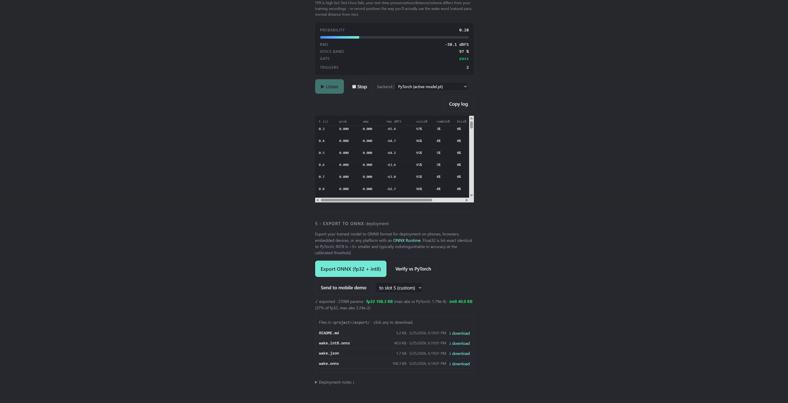

# The studio (browser UI)

The studio is a local web app for the whole workflow: record data, train, see
whether the model generalizes, test it live on your own voice, and export. It
runs on your machine; the browser only uses your microphone, and no audio leaves
the device.



## Launch

```bash
pip install "heed-wakeword[ui]"
heed ui                 # opens http://127.0.0.1:7777
```

Options: `heed ui --host 0.0.0.0 --port 7777 --workspace ./my-projects`. The
workspace is where projects (recordings, models, exports) are stored. With
`[tts]` and `[kokoro]` installed, the studio can also synthesize training data;
run `heed download-tts` (and optionally `heed download-kokoro`) once first.

## 1. Create a project

A project is one wake phrase plus its data and models. Create one, give it a
phrase like "hey jasper", and you land on its workspace.

## 2. Collect data

Quality of data is the biggest lever on quality of model.

- **Record positives.** Say the phrase several times straight from the browser.
  Vary your distance from the mic, your tone, and the room. 8 to 30 takes,
  variety over count.
- **Record negatives.** Any short sentences that are not the phrase. The studio
  also suggests **phonetic neighbors** (for "hey jasper" it proposes "hey",
  "jasper" alone, "hey john", and similar near-misses) and lets you record them
  in one click. These hard negatives teach the model the boundary and are the
  single best defense against false triggers.
- **Upload clips.** Drag in existing `.wav` files instead of recording, if you
  have them.
- **Capture ambient.** Record a few seconds of your room's background so training
  can mix it in.

## 3. Train

Pick a model size (small, medium, large) and start training. A progress view
streams epoch loss and accuracy live. If TTS is installed you can also synthesize
many extra speakers saying the phrase, which makes the model work for voices
other than yours. Each training run is saved as a model slot, so you can train
several and compare without losing the earlier ones.

## 4. Check that it generalizes

These tell you whether the model works beyond the exact clips it trained on,
before you ship it.

- **Held-out evaluation** reports TPR and FPR on speakers that were deliberately
  kept out of training. This is the honest cross-speaker signal.
- **Cross-TTS test** runs the model against a second TTS family (Kokoro) it never
  trained on, a second independent check on generalization.
- **Self test and test takes** let you record a fresh clip and see the exact
  score, so you can confirm it fires on you and not on look-alike phrases.

## 5. Test it live

Live test streams your microphone through the model in real time and shows the
probability bar, the trigger threshold, and a log of every trigger. This is the
closest thing to the deployed experience.

## 6. Manage model slots

Each project keeps multiple trained models as slots. You can activate one as the
project's current model, or delete slots you no longer want. Activating is what
the export and live-test actions use.

## 7. Export and send to a device

- **Export** writes `wake.onnx`, `wake.int8.onnx`, `wake.tflite` (when
  `litert-torch` is available), and the `wake.json` contract, plus a deployment
  README. You can download them or **verify** that the ONNX output matches the
  PyTorch model numerically.
- **Send to mobile** exports and copies the files straight into a slot of the
  React Native demo (`examples/inference_react_native/assets/`), so you can
  reload the app and hear your own word on a phone.

See [Export and deploy](export-and-deploy.md) for what to do with the files.
